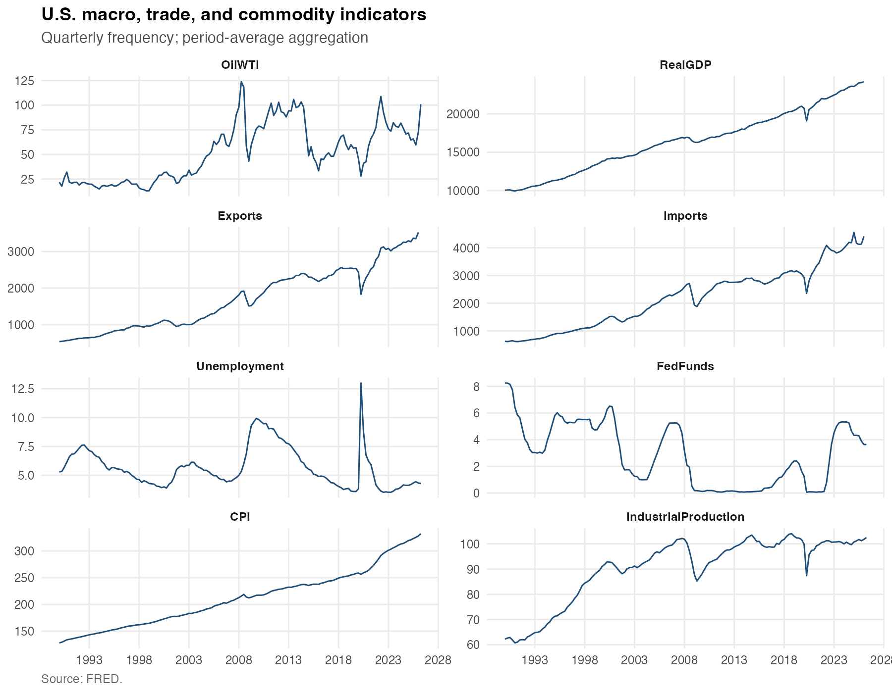
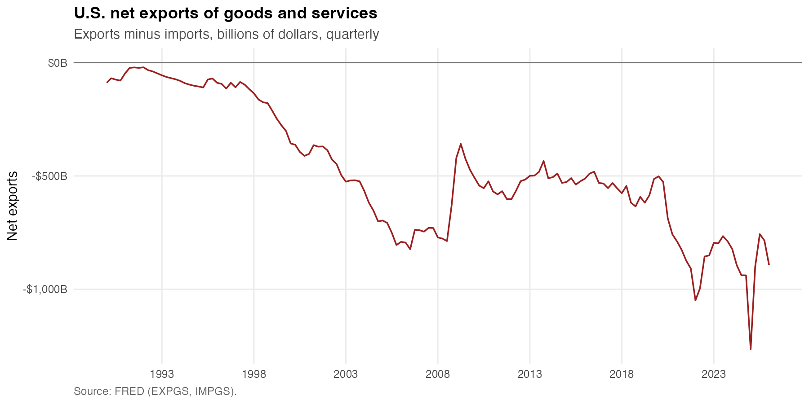
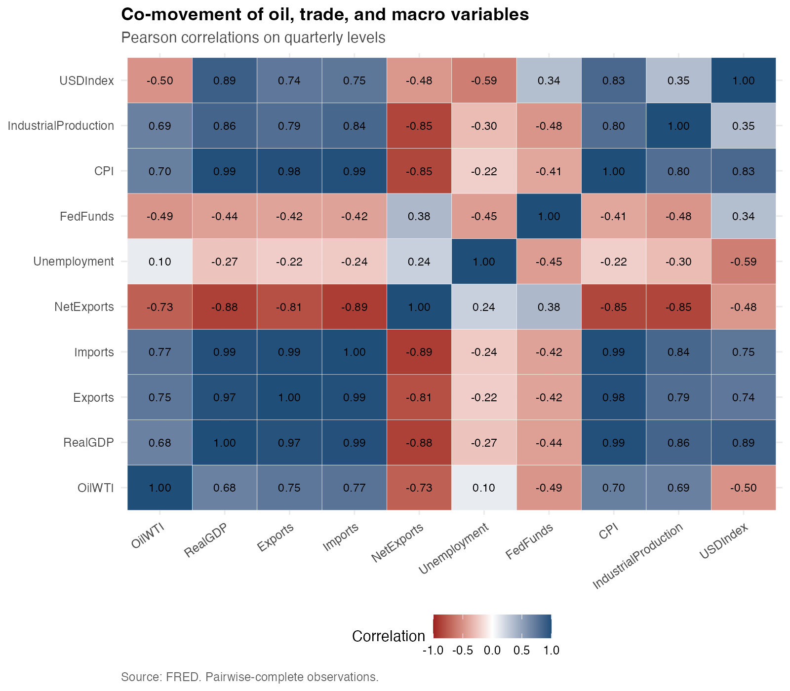
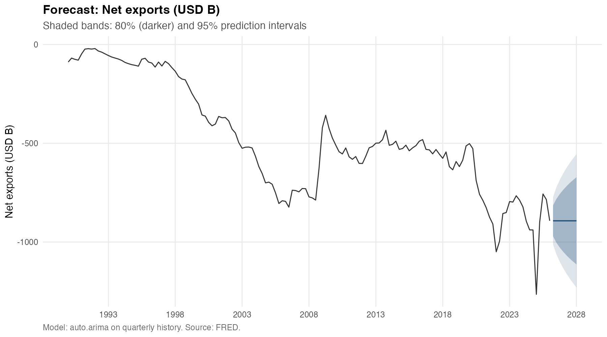
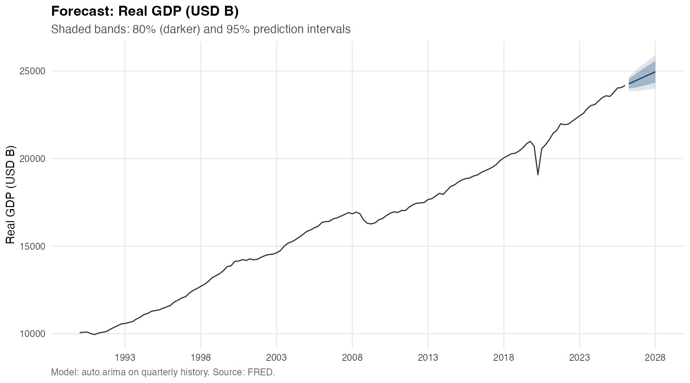
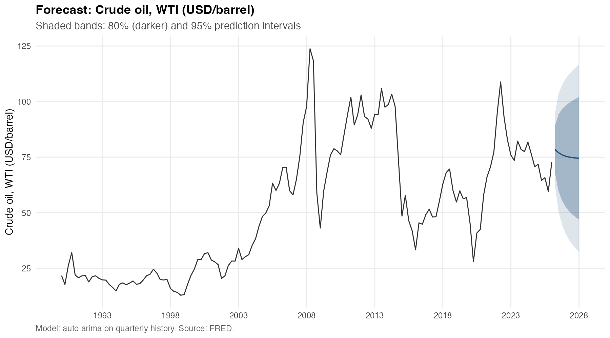
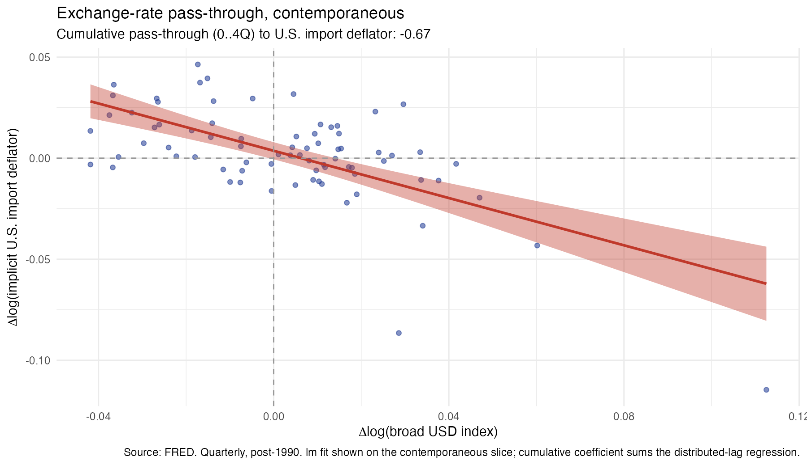

# r-macro-trade-commodity-forecast

[](https://www.r-project.org/)
[](https://github.com/yullieyang/r-macro-trade-commodity-forecast/actions/workflows/r-checks.yml)
[](https://yullieyang.github.io/r-macro-trade-commodity-forecast/)
[](LICENSE)
[](https://fred.stlouisfed.org/)

> A reproducible R workflow for macro / trade data harmonization, derived
> indicators, and baseline forecasting — built as a portfolio-style
> research-support project on public FRED data.



## Project overview

This project is a portfolio-style research-support workflow designed to
demonstrate reproducible data collection, transformation, documentation, and
baseline analysis for financial / economic research contexts.

Concretely, it retrieves 13 U.S. macro, trade-flow, and commodity-price
series from FRED, harmonizes them into a quarterly panel, computes
standard derived measures (nominal and real net exports, implicit trade
deflators, terms of trade) used in international-trade research, produces
8-quarter
`auto.arima` baseline forecasts for three targets (net exports, real GDP,
WTI crude oil), and estimates a distributed-lag exchange-rate pass-through
regression on U.S. import and export deflators. Every artifact (cleaned
data, model summaries, forecast tables, figures) is written to disk and
committed to Git so a reviewer can audit every step without rerunning R.

The repository is intended to show **workflow design, documentation, and
analytical reasoning**, not to present a production forecasting system or a
policy view.

## Why this project matters

Macro and trade research-support work is heavy on recurring data tasks:
pulling series from authoritative sources, aligning mixed frequencies,
constructing derived measures, computing short-horizon baselines, and
documenting assumptions so the work is reviewable. The pipeline shows how
that recurring work can be packaged in code — parameterized, reproducible,
and reviewable through Git — rather than as ad-hoc spreadsheets.

See [`docs/research_themes.md`](docs/research_themes.md) for the four
research themes the pipeline directly addresses (real-vs-nominal trade,
exchange-rate pass-through, net-exports forecasting, commodity dynamics).

## Data sources

All data are sourced from the Federal Reserve Bank of St. Louis FRED
database via the `fredr` R package. No proprietary or non-public data is
used. The default series list lives in `scripts/01_get_data.R` and is the
single place to edit series IDs or labels.

| Series ID    | Description                                            | Frequency | Used for |
|--------------|--------------------------------------------------------|-----------|----------|
| `GDPC1`      | Real Gross Domestic Product (chained 2017 dollars)     | Quarterly | Input + forecast target |
| `UNRATE`     | Civilian Unemployment Rate                             | Monthly   | Input (descriptive) |
| `FEDFUNDS`   | Effective Federal Funds Rate                           | Monthly   | Input (descriptive) |
| `CPIAUCSL`   | Consumer Price Index for All Urban Consumers           | Monthly   | Input + pass-through control |
| `INDPRO`     | Industrial Production: Total Index                     | Monthly   | Input (descriptive) |
| `EXPGS`      | Exports of Goods and Services (nominal)                | Quarterly | Input + derived (NetExports, ExportDeflator) |
| `IMPGS`      | Imports of Goods and Services (nominal)                | Quarterly | Input + derived (NetExports, ImportDeflator) |
| `EXPGSC1`    | Real Exports of Goods and Services                     | Quarterly | Input + derived (RealNetExports, ExportDeflator) |
| `IMPGSC1`    | Real Imports of Goods and Services                     | Quarterly | Input + derived (RealNetExports, ImportDeflator) |
| `DTWEXBGS`   | Nominal Broad U.S. Dollar Index (Goods & Services)     | Daily     | Pass-through regressor |
| `DCOILWTICO` | Crude Oil Prices: West Texas Intermediate (WTI)        | Daily     | Input + forecast target |
| `DHHNGSP`    | Henry Hub Natural Gas Spot Price                       | Daily     | Input (descriptive) |
| `PCOPPUSDM`  | Global Price of Copper                                 | Monthly   | Input (descriptive) |

## Workflow

The pipeline runs as five numbered stages plus an orchestrator, each script
self-contained and re-runnable independently.

1. **Ingest** — `scripts/01_get_data.R` calls `get_fred_series()` once per
   series and writes a long-format raw snapshot to `data/raw/`.
2. **Clean & transform** — `scripts/02_clean_transform_data.R` aligns every
   series to a common quarterly grid via period-average aggregation,
   computes derived measures (net exports, year-over-year and
   quarter-over-quarter growth, log oil price, implicit import / export
   deflators, terms of trade), and writes
   `data/processed/cleaned_macro_trade_data.csv`.
3. **Explore** — `scripts/03_exploratory_analysis.R` produces a
   descriptive summary table, a multi-panel time-series chart, a
   net-exports trend chart, and a correlation heatmap.
4. **Forecast** — `scripts/04_forecast_model.R` loops over a configurable
   target list (`NetExports`, `RealGDP`, `OilWTI`), fits an ARIMA model
   selected by `forecast::auto.arima` for each, generates an 8-quarter
   forecast with 80% / 95% prediction intervals, and writes combined
   model-summary and forecast-results tables plus one figure per target.
5. **Pass-through (4b)** — `scripts/04b_pass_through.R` estimates a
   distributed-lag regression of Δlog(import / export deflator) on
   Δlog(broad dollar) with 0–4 quarter lags and a CPI control, and reports
   the cumulative pass-through coefficient with a contemporaneous
   co-movement scatter.
6. **Orchestrate** — `scripts/05_generate_outputs.R` sources stages 1 → 4b
   in order so a reviewer can reproduce every artifact with a single call.

## Methods

- **Frequency alignment.** Daily and monthly series are aggregated to
  quarterly period averages via `R/transform_utils.R::to_quarterly()`. The
  trade-off (loss of intra-quarter dynamics) is documented in
  [`docs/methodology.md`](docs/methodology.md) §2.
- **Derived measures.** Nominal and real net exports, trade balance ratio,
  implicit import / export deflators (`nominal / chained-real × 100`),
  terms of trade (`ExportDeflator / ImportDeflator`), YoY and QoQ growth
  on all level columns, log oil price, and quarter-over-quarter oil change.
  Formulas are listed in [`docs/methodology.md`](docs/methodology.md) §3.
- **Baseline forecasting.** `forecast::auto.arima` with `stepwise = FALSE`
  and `approximation = FALSE` (full-grid search), 8-quarter horizon, 80%
  and 95% prediction intervals. ARIMA is deliberately framed as a
  univariate baseline; richer models (VAR, BVAR, state-space) are listed
  as future improvements.
- **Pass-through regression.** Single-equation OLS of Δlog(deflator) on
  contemporaneous and lagged Δlog(USD index) (lags 0–4) with a Δlog(CPI)
  control. The cumulative pass-through coefficient is the sum of the FX
  terms. Standard errors are classical OLS via
  `broom::tidy(conf.int = TRUE)`; HC-robust standard errors via
  `sandwich::vcovHC()` are a noted next step.

## Outputs

All outputs are committed to the repository so reviewers can inspect them
without running R locally.

**Data and tables**

- `data/processed/cleaned_macro_trade_data.csv` — analysis-ready quarterly
  panel with raw levels and derived measures.
- `outputs/tables/descriptive_summary.csv` — per-series n / range / mean / sd.
- `outputs/tables/model_summary.csv` — ARIMA coefficients (estimate, SE,
  z, p-value) plus AIC / BIC / sigma² / log-likelihood / n, stacked across
  forecast targets with a `target` column.
- `outputs/tables/forecast_results.csv` — point forecasts and 80% / 95%
  prediction intervals for the next 8 quarters, per target.
- `outputs/tables/passthrough_coefficients.csv` — per-term estimate, SE,
  t-statistic, p-value, and 95% confidence interval, with the cumulative
  pass-through coefficient repeated on each row for the relevant target.

**Figures** (rendered below from `outputs/figures/`)

### Macro, trade, and commodity overview


### Net exports trend



### Co-movement of oil, trade, and macro variables



This is a descriptive correlation chart, not a causal decomposition.

### 8-quarter ARIMA forecast — net exports

`auto.arima` selected **ARIMA(0,1,0)** for net exports — i.e. a random
walk without drift. This is a defensible baseline; the chart shows the
flat point forecast with fanning prediction bands.



### 8-quarter ARIMA forecast — real GDP

`auto.arima` selected **ARIMA(0,1,1) with drift** for real GDP — an MA(1)
on first differences plus a positive drift term capturing trend growth.
The same pipeline handles structurally different targets without manual
intervention.



### 8-quarter ARIMA forecast — crude oil (WTI)

A commodity-price target alongside the macro and trade targets, run through
the same `auto.arima` machinery. Model selection, prediction intervals,
and output schema match the macro targets.



### Exchange-rate pass-through to U.S. import prices

Stage 4b estimates the share of a quarterly move in the broad
trade-weighted dollar that is reflected in the implicit U.S. import
deflator, with 0–4 quarter lags and a CPI control. The cumulative
coefficient is reported in `outputs/tables/passthrough_coefficients.csv`;
the figure shows the contemporaneous slice of the regression. The
coefficient is a reduced-form empirical association, not a causal
estimate.



## Reproducibility

- **Pinned dependencies.** [`renv.lock`](renv.lock) captures every package
  version so a fresh clone reproduces the exact environment with
  `renv::restore()`.
- **One-command run.** `source(here::here("scripts", "05_generate_outputs.R"))`
  regenerates every committed artifact.
- **Path discipline.** Every file path goes through `here::here()`; no
  `setwd()`, no absolute paths in source.
- **Credentials isolated.** The FRED API key lives in `.Renviron` (loaded
  by R at startup; git-ignored). The repo ships `.Renviron.example` as a
  template.
- **Tests.** `tests/testthat/` contains a `testthat` suite (12 test
  blocks, 30 assertions) exercising the transform helpers and the
  pass-through regression on synthetic data with a known coefficient.
- **Continuous integration.** [`.github/workflows/r-checks.yml`](.github/workflows/r-checks.yml)
  parses every `.R` file, runs `lintr`, and executes the `testthat`
  suite on every push and PR.
- **Quarto dashboard.** [`.github/workflows/publish.yml`](.github/workflows/publish.yml)
  renders `index.qmd` to GitHub Pages on every push to `main`
  (live at <https://yullieyang.github.io/r-macro-trade-commodity-forecast/>).
- **Briefing memo.** [`docs/briefing_template.qmd`](docs/briefing_template.qmd)
  renders the committed `outputs/` into a one-page research-support memo
  via `quarto render docs/briefing_template.qmd --to html`.

### How to run

```r
# 1. Install (reproducible — uses renv.lock)
install.packages("renv")
renv::restore()
```

```bash
# 2. Set FRED API key
cp .Renviron.example .Renviron
# edit .Renviron and set FRED_API_KEY=your_key_here
```

```r
# 3. Run the pipeline
source(here::here("scripts", "05_generate_outputs.R"))
```

```bash
# 4. Run the test suite
Rscript tests/testthat.R

# 5. Render the briefing memo
quarto render docs/briefing_template.qmd --to html
```

If you prefer to install packages without `renv`:

```r
install.packages(c(
  "tidyverse", "lubridate", "fredr", "forecast",
  "ggplot2", "readr", "broom", "here", "scales", "testthat"
))
```

## Limitations

- **Univariate baseline.** `auto.arima` ignores the covariates the panel
  carries (dollar, oil, rates). A multivariate VAR or local-projections
  approach would use them and is listed in Future improvements.
- **Reduced-form pass-through.** The OLS regression treats the dollar as
  exogenous. In practice the dollar co-moves with the same shocks that
  move U.S. trade prices, which biases simple OLS toward zero. IV
  identification or a structural model is the right next step.
- **Classical OLS standard errors.** Pass-through inference uses classical
  (non-robust) standard errors; HC-robust SEs via `sandwich::vcovHC()`
  are noted as a future improvement.
- **Quarterly aggregation.** Period-average aggregation discards
  intra-quarter variation in oil, FX, and policy-rate series. For
  event-style questions a mixed-frequency (MIDAS) approach would be more
  appropriate.
- **No structural-break handling.** Forecasts are unconditional; the COVID
  shock is in-sample and treated as ordinary variance. Breakpoint
  diagnostics and scenario conditioning are out of scope.
- **No out-of-sample evaluation.** Backtesting and cross-validation of the
  forecasts are not implemented.
- **FRED dependency.** The pipeline assumes FRED series IDs and definitions
  are stable; if a series is renamed or deprecated, the catalog in
  `scripts/01_get_data.R` is the single place to update.

## Skills demonstrated

- **R for research-support workflows** — modular helper layer under `R/`,
  numbered pipeline stages under `scripts/`, `here::here()` path discipline,
  deterministic artifact paths.
- **Time-series forecasting** — `forecast::auto.arima` over a configurable
  target list with 80% and 95% prediction intervals; targets with
  structurally different selected models (`ARIMA(0,1,0)` for net exports,
  `ARIMA(0,1,1) + drift` for real GDP, `ARIMA(1,1,2)` for WTI) handled by a
  single loop.
- **Empirical trade economics** — distributed-lag exchange-rate
  pass-through regression with a CPI control; cumulative coefficient
  computed for both the import and export deflators; results tidied to
  the same row-per-term schema as the ARIMA outputs.
- **Frequency alignment** — daily, monthly, and quarterly series
  harmonized to a quarterly panel via period-average aggregation, with
  the aggregation rule documented in `docs/methodology.md`.
- **Reproducibility and review** — `renv` lockfile, Git-tracked outputs,
  one-command run, FRED API key isolated to a git-ignored `.Renviron`,
  CI on push.
- **Testing** — `testthat` suite under `tests/testthat/` exercising
  derived-measure math and the pass-through regression on synthetic data
  with a known coefficient.
- **Documentation discipline** — methodology, data dictionary,
  research-themes write-up, and a Quarto briefing template under `docs/`.

## Future improvements

- Replace the univariate ARIMA with a small VAR over oil, trade flows, and
  GDP, with impulse-response diagnostics.
- Add IV identification of the dollar in the pass-through regression
  (basket-shift, monetary-policy surprise) and HC-robust standard errors
  via `sandwich::vcovHC()`.
- Add an out-of-sample evaluation harness (expanding-window cross-validation)
  so forecast performance is measurable across runs.
- Extend the existing CI to refresh FRED data on a monthly cron and publish
  the regenerated figures as build artifacts.
- Add a Quarto-rendered briefing version that ships as a release artifact.

## Portfolio Context

This project translates recurring patterns from financial/economic
research-support work — recurring data refresh, harmonization across
mixed frequencies, derived measures, baseline forecasting, and
reviewable outputs — into a public portfolio demonstration. It uses
only public FRED data and does not replicate any proprietary system.
The goal is to show workflow design, documentation, and analytical
reasoning rather than to present a production system.

## What this project does not do

- It does **not** replace domain expertise or analyst judgment.
- It does **not** make policy conclusions or represent any official view.
- It does **not** use proprietary, embargoed, or non-public data.
- It does **not** claim production readiness — there is no monitoring,
  alerting, SLA, or deployment process attached to it.
- It does **not** support causal claims. The pass-through coefficient and
  the correlation heatmap are descriptive empirical associations.
- It does **not** forecast trade prices, terms of trade, or any series
  beyond the three explicit ARIMA targets (`NetExports`, `RealGDP`,
  `OilWTI`).

## Development

Series selection, derived-measure formulas, ARIMA target list,
pass-through specification, methodology, and limitation language are
analyst-owned and independently verified. No credential or non-public
data was given to any external model.

AI coding tools (e.g. [Claude Code](https://claude.com/claude-code))
were used during development for scaffolding the modular `R/` helper
layer and the numbered `scripts/` pipeline, drafting docstrings and
documentation passes in `docs/`, and consistency checks on naming and
`here::here()` path discipline before commit. AI coding tools may
support scaffolding, documentation review, and consistency checks, but
the workflow logic, assumptions, validation criteria, and final outputs
remain human-reviewed.

A companion repository,
[`llm-research-workflow-assistant`](https://github.com/yullieyang/llm-research-workflow-assistant),
codifies this posture into reusable prompt templates, sample QC and
brief-review outputs, and a human-in-the-loop checklist.

## Project summary

A reproducible R pipeline that turns 13 public FRED series into a
quarterly macro / trade / commodity panel, produces `auto.arima`
baseline forecasts with documented uncertainty for net exports, real
GDP, and WTI, and estimates the cumulative pass-through of the broad
dollar to U.S. import and export deflators.

### Technical summary

The pipeline pulls 13 FRED series — macro headline, nominal and real
trade flows, the broad dollar, and three commodities — and aligns
them to a quarterly panel. On top of the panel it computes the
derived measures used in trade research: net exports, implicit import
and export deflators, terms of trade. It produces 8-quarter
`auto.arima` baseline forecasts for net exports, real GDP, and WTI
crude with 80% and 95% prediction intervals, and estimates a
distributed-lag pass-through regression of the implicit trade
deflators on the dollar. Everything is one command to reproduce, has
a `testthat` suite, runs in CI, and renders a Quarto briefing memo.

### Design rationale

- **The empirical chain is end-to-end.** Real-vs-nominal trade →
  implicit deflators → terms of trade → pass-through regression — all
  sourced from a single FRED panel, tied together by shared helper
  functions, and re-runnable from one command.
- **The scaffolding is genuine.** Numbered stages, modular helpers,
  parameterized configuration, `renv` lockfile, `testthat` suite (12
  test blocks, 30 assertions), GitHub Actions CI, Pages dashboard,
  Quarto briefing template — the muscles of a research-support
  workflow, not just the math.
- **The tests do real work.** Writing them surfaced a real edge-case
  bug in `fit_passthrough_lm` (R's `paste0` recycling rule injected a
  phantom column when `max_lag = 0`). The fix is in the commit
  history; the test is in the suite.

### Honest limitations

- ARIMA is a univariate baseline. The panel carries the covariates a
  richer model would use; a VAR is the natural next step.
- The pass-through OLS treats the dollar as exogenous and uses
  classical (non-robust) standard errors. IV identification and
  HC-robust SEs are noted next steps.
- No out-of-sample evaluation. Backtesting / expanding-window
  cross-validation is not implemented.

## Folder structure

```
r-macro-trade-commodity-forecast/
├── README.md
├── LICENSE                      # MIT
├── .Renviron.example            # Template for FRED_API_KEY
├── .gitignore
├── renv.lock                    # Pinned package versions
├── R/                           # Reusable helper functions
│   ├── data_utils.R
│   ├── transform_utils.R
│   ├── plot_utils.R
│   ├── model_utils.R
│   ├── passthrough_utils.R
│   └── io_utils.R
├── scripts/                     # Numbered pipeline stages
│   ├── 01_get_data.R
│   ├── 02_clean_transform_data.R
│   ├── 03_exploratory_analysis.R
│   ├── 04_forecast_model.R
│   ├── 04b_pass_through.R
│   └── 05_generate_outputs.R
├── tests/                       # testthat suite
│   ├── testthat.R
│   └── testthat/
│       ├── test-transform_utils.R
│       └── test-passthrough_utils.R
├── data/
│   ├── raw/                     # Raw FRED snapshots
│   └── processed/               # Quarterly panel + derived measures
├── outputs/
│   ├── figures/                 # PNG charts
│   └── tables/                  # CSV summaries
├── docs/
│   ├── methodology.md
│   ├── data_dictionary.md
│   ├── research_themes.md
│   └── briefing_template.qmd
└── .github/workflows/
    ├── r-checks.yml             # Parse + lint + tests
    └── publish.yml              # Quarto Pages dashboard
```

## License

MIT — see [LICENSE](LICENSE).
